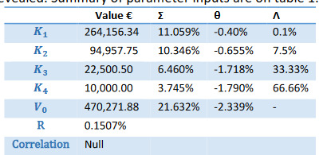

# sequential_investment_valuation
## An Adkins &amp; Paxson method Modelling on Sequential Investment Opportunites for Project Valuation. (Quantitative Finance) Programmatic Implementation

Roger Adkins*

Bradford University School of Management

Dean Paxson**

Manchester Business School

**Israel Castillo Herrera** - Python Modelling

Ingeniería Financiera. 2020.

Submitted to Real Options Conference, Japan
26 January, 2013

## Abstract

An analytical solution for American perpetual compound options, that do not rely on
a bivariate or multivariate distribution function. This model is especially applicable for a real
sequential investment opportunity, such as a series of drug development, tests and clinical trials,
where the project can be cancelled at any time, and where the probability of failure declines over
stages of completion. The effect of changing input parameter values can clearly be seen in terms
of resulting overall project process volatility, and the effective mark-up factor which justifies
continuing with each investment stage. I

### Problem Setup - Initial Variables

